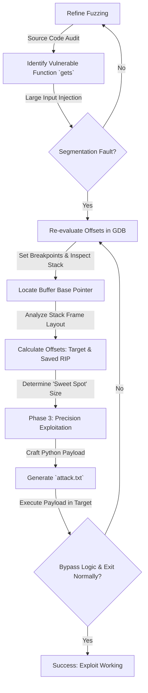
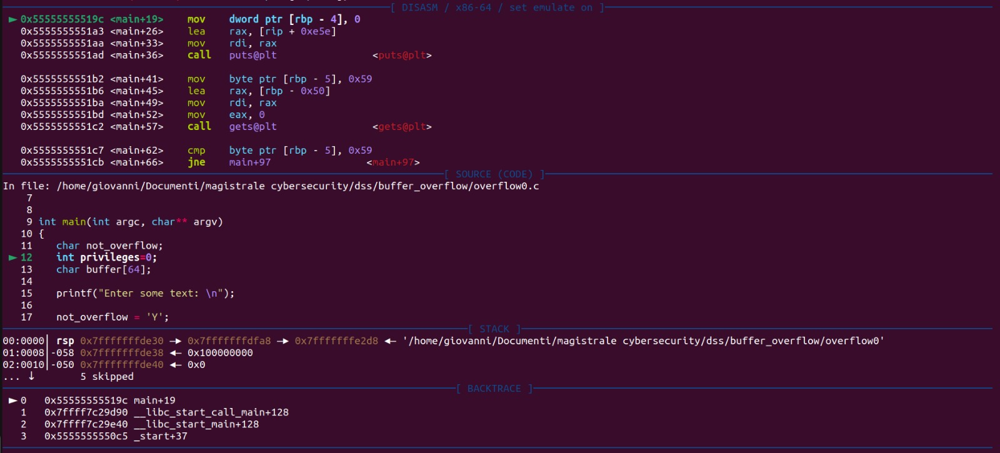
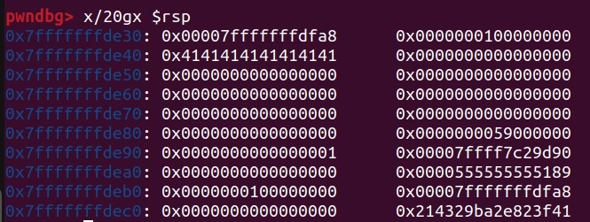

# Stack-Based Buffer Overflow: Memory Analysis & Precision Exploitation

> **University Project | Data Security Systems Laboratory**
> **MSc Cybersecurity**
> A methodological deep dive into discovering, analyzing, and precisely exploiting a classic stack-based buffer overflow vulnerability to hijack control flow.

| Info | Details |
| :--- | :--- |
| **👤 Author** | **Giovanni Del Bianco** |
| **💻 Language** | **C** (Target), **Python 3** (Exploit Generator) |
| **🛠️ Tools** | **GCC**, **GDB**, **PwnDbg** |
| **🧠 Key Concepts** | **Memory Forensics**, **Stack Frame Layout**, **Return Address (`saved RIP`)**, **Instruction Pointer Hijacking**, **Offset Calculation**. |
| **🎯 Goal** | Analyze a vulnerable C program, calculate exact memory offsets using a debugger, and craft a precise payload to bypass authentication logic without crashing the application. |

---

## 🚨 The Scenario: Mission Briefing

### 1. The Target Application
In this laboratory scenario, we are presented with a simple C application (`overflow0.c`) that simulates a basic privilege check. The application asks the user for input and, based on an internal variable (`not_overflow`), decides whether to grant access to a "secret password".

By default, the application is designed to deny access. The logic is hardcoded so that the condition to print the secret is never met during normal execution.

```c
// Snippet of the target logic
char not_overflow = 'Y';
int privileges = 0;
char buffer[64];

gets(buffer); // The critical vulnerability

if (not_overflow == 'Y') {
    printf("Can't Overflow Me...\n");
} else {
    privileges = 1; // Unreachable under normal conditions
}

if (privileges == 1) {
    printf("Your secret password is stefano123\n");
}
```

### 2. Vulnerability Assessment (White-Box)
A static analysis of the source code immediately reveals a critical flaw: the use of the `gets()` function. 

*   **The Flaw:** `gets()` reads input from standard input and stores it into the provided `buffer` until a newline character is found. Crucially, **it performs absolutely no bounds checking**. It has no way of knowing that our `buffer` is only allocated for 64 bytes.
*   **The Impact:** If a user inputs more than 64 characters, `gets()` will happily continue writing data into the adjacent memory space on the **Stack**, overwriting whatever variables or control data are stored there.

### 3. Threat Model & Objective
*   **Adversary Capability:** We have local access to the binary and the source code (White-Box testing). We can control the input provided to the application.
*   **The Objective:** The goal is not simply to crash the program (Denial of Service). Our objective is **Control Flow Hijacking**. We must craft a specific input (a *payload*) that overflows the 64-byte buffer and precisely overwrites the `not_overflow` variable, changing its value from `'Y'`. 
*   **The Constraint:** We must achieve this *without* overwriting critical execution data (like the Return Address), ensuring the program successfully enters the `else` block, prints the secret, and exits cleanly.


## 🧠 The Engineering Approach

### "Precision Exploitation, Not Brute Force"
A common misconception about buffer overflows is that they simply involve throwing massive amounts of random data at a program until it breaks. While this *fuzzing* approach can discover a vulnerability (causing a crash), it is rarely sufficient to build a working exploit.

To successfully hijack the control flow without causing a Segmentation Fault, a strict analytical methodology is required. The exploit must be a precise surgical strike. We need to know exactly *where* our data is landing in memory and *what* it is overwriting.

To achieve this, I adopted a structured **five-phase exploit development lifecycle**:

### 🏗️ Exploit Development Pipeline
This project is structured around a clear methodology, moving from static analysis to dynamic memory forensics, and finally to payload execution:



### 🔬 Methodology Breakdown

1.  **Phase 1: Fuzzing (The Crash)**
    *   **The Goal:** Confirm the vulnerability dynamically. By providing a deliberately oversized input (e.g., 100 characters), we force the program to overwrite critical control data (the Instruction Pointer, `RIP`) saved on the stack, causing a `Segmentation fault`.
    *   **The Result:** This proves we can write beyond the buffer's bounds and control the program's execution state, albeit destructively.

2.  **Phase 2: Memory Forensics (GDB & PwnDbg)**
    *   **The Goal:** Map the Stack Frame. Using the GNU Debugger (GDB) enhanced with PwnDbg, we step through the assembly instructions (`disasm`) and inspect raw memory (`x/20gx $rsp`).
    *   **The Process:** We send a recognizable pattern (e.g., "AAAAAAAA") and locate it in memory. We then find the memory addresses of our target variable (`not_overflow`) and the crucial Return Address (`saved RIP`).

3.  **Phase 3: Offset Calculation (The Math)**
    *   **The Goal:** Calculate the exact distance (offset) in bytes from the start of our input buffer to the target variable, and the distance to the Return Address.
    *   **The Result:** We determine the precise size our payload must be to overwrite the target *without* corrupting the Return Address.

4.  **Phase 4: Payload Crafting (Python)**
    *   **The Goal:** Automate payload generation. We create a Python script to generate a file containing the exact number of characters calculated in Phase 3. This ensures repeatability and precision.

5.  **Phase 5: Execution (The Hijack)**
    *   **The Goal:** Deliver the tailored payload to the target application and observe the successful bypass of the authentication logic, resulting in a clean exit.


## 🔬 Phase 1: Static Analysis & Fuzzing (The Crash)

### 1. Preparing the Target: Compilation
Before we can analyze the application dynamically, we need to compile the source code (`overflow0.c`) into an executable binary. This step is crucial because modern compilers (like GCC) include built-in defenses against the exact attack we are trying to perform.

```bash
gcc -g -fno-stack-protector src/overflow0.c -o overflow0
```

**Understanding the Compiler Flags:**
This command is not arbitrary; it sets up our environment for exploitation:
*   `-g`: This flag is essential for debugging. It tells GCC to embed **debugging information** directly into the binary. This links the machine code back to our original C source code, allowing tools like GDB to tell us exactly which line of C code corresponds to the assembly instruction we are analyzing.
*   `-fno-stack-protector`: **The critical enabler.** By default, GCC employs a protection mechanism known as a **Stack Canary** (or Stack Protector). It places a random value (the "canary") on the stack just before the return address. Before a function returns, it checks if the canary is intact. If a buffer overflow occurs, the canary is overwritten, the check fails, and the program halts securely, preventing exploitation.
    *   *Why use this flag?* For educational purposes, we explicitly disable this protection to understand the fundamental mechanics of a raw stack buffer overflow.

*Note: Even during compilation, GCC emits a stark warning: `warning: the 'gets' function is dangerous and should not be used.`*

### 2. Fuzzing: Confirming the Vulnerability
With the binary compiled and protections lowered, the first step in exploit development is to confirm we can trigger a fault. We do this by feeding the program input significantly larger than its expected bounds (64 bytes).

Instead of typing manually, we use Python to generate a massive, precise payload (100 'A' characters) and pipe it into the program.

```bash
# Generating a 100-byte payload using Python inline
python3 -c 'print("A"*100)' > exploits/attack.txt

# Feeding the payload to the vulnerable binary
./overflow0 < exploits/attack.txt
```

**The Result: Segmentation Fault**
```text
Errore di segmentazione (core dump creato)
```
*(Segmentation fault (core dumped))*

### Analyzing the Crash
We have successfully crashed the program. But *why* did it crash?
1.  Our input of 100 bytes far exceeded the 64-byte capacity of `buffer`.
2.  The `gets()` function continued writing `0x41` (the ASCII hex value for 'A') linearly up the stack.
3.  The overflow was so massive that it overwrote not only adjacent local variables but also critical stack frame metadata—specifically, the **saved Instruction Pointer (saved RIP)**.
4.  When the `main` function attempted to complete and return to the operating system, the CPU tried to jump to the address stored in the saved RIP. Because we overwrote it with `0x4141414141414141` (an invalid, non-executable memory address), the OS intervened and terminated the process, generating a Segmentation Fault.

This proves we have control over the execution flow. The challenge now is to refine this chaotic crash into a controlled, surgical strike. To do that, we need to look under the hood using a debugger.


## 🕵️‍♂️ Phase 2: Memory Forensics (GDB & PwnDbg)

### The Objective: Precision Mapping the Stack Frame
To avoid crashing the program (Segmentation Fault), we must stop treating the buffer as a black box and treat the Stack Frame as a precise map. We need to calculate the exact distance (offset) from the beginning of our `buffer` (where our input starts) to our target variable (`not_overflow`), and importantly, to the Return Address (`saved RIP`).

To do this, we employ the **GNU Debugger (GDB)** enhanced with the **PwnDbg** plugin. This provides a powerful, visual interface for examining the CPU state, assembly instructions, and raw memory.

### Step 1: Establishing the Baseline (The "Before" Picture)
First, we need to see what a "clean" stack looks like before our input is written. We set a breakpoint immediately upon entering the `main` function.

```bash
gdb ./overflow0
```
```gdb
pwndbg> break main
pwndbg> run
```

At this point, the program pauses at the very beginning of its execution (`int privileges=0;`).

**Analyzing the Clean Stack:**
*(Insert your `gdb_stack_before.png` here)*


*   **The Baseline:** We use the command `x/20gx $rsp` to examine the top 20 blocks (8 bytes each) of the stack starting from the Stack Pointer (`$rsp`).
*   **Observation:** The memory is largely empty (zeros) or contains legitimate, structured pointers related to the program's initialization. This is our baseline.

### Step 2: Injecting the Trace Pattern (The "After" Picture)
To find our buffer, we need a "tracer bullet". We set a second breakpoint immediately after the `gets()` function call (line 20) and provide a small, highly recognizable input.

```gdb
pwndbg> break 20
pwndbg> continue
Enter some text: AAAAAAAA
```

We send exactly 8 'A' characters (`0x41` in ASCII hex). The program pauses again after reading our input.

**Analyzing the Overwritten Stack:**
*(Insert your `gdb_stack_after.png` here)*


*   **Locating the Buffer:** We run `x/20gx $rsp` again. The difference is stark. At address `0x7fffffffde40`, we clearly see `0x4141414141414141`. We have definitively found the starting address of our `buffer[64]`.
*   **Locating the Target (`not_overflow`):** Looking slightly higher in the stack memory (address `0x7fffffffde80`), we spot the value `0x0000000059000000`. The byte `0x59` is the ASCII representation for 'Y'—the initialization value of `not_overflow`. This confirms its location precisely.

### Step 3: Calculating the Payload Math
With the locations mapped, we can calculate the exact offsets required for a successful exploit.

**1. Finding the Target Offset (`not_overflow`)**
*   **Buffer Start Address:** `0x7fffffffde40`
*   **`not_overflow` Address:** `0x7fffffffde8b` (Calculated using PwnDbg's disassembly: `[rbp - 5]`. Base Pointer `RBP` is `0x7fffffffde90`, minus 5 is `0xde8b`).
*   **Calculation:** `0xde8b - 0xde40` = `0x4b` (hexadecimal) = **75 bytes**.
*   **Conclusion:** We must write exactly 75 bytes to reach the `not_overflow` variable. The 76th byte we write will overwrite it.

**2. Finding the Safe Boundary (`saved RIP`)**
To prevent a crash, we must also locate the `saved RIP` (Return Instruction Pointer). We use GDB's `info frame` command to analyze the stack structure.

```gdb
pwndbg> info frame
Stack level 0, frame at 0x7fffffffdf40:
 rip = 0x5555555551c7 in main (overflow0.c:19); saved rip = 0x7ffff7c29d90
 ```

This tells us the `saved RIP` is stored at the end of the stack frame. By analyzing the memory dump, we see it begins at `0x7fffffffde98` (just after the saved `RBP` at `0xde90`).

*   **Buffer Start Address:** `0x7fffffffde40`
*   **`saved RIP` Address:** `0x7fffffffde98`
*   **Calculation:** `0xde98 - 0xde40` = `0x58` (hexadecimal) = **88 bytes**.
*   **Conclusion:** If we write 88 bytes, we touch the `saved RIP`. If we write 89 bytes, we corrupt it, causing a crash.

### The Exploit Window
Based on our forensic analysis, our payload must be:
*   **At least 76 bytes long:** To successfully overwrite the target `not_overflow`.
*   **No more than 87 bytes long:** To safely avoid corrupting the `saved RIP`.

Any payload length between 76 and 87 bytes is our "Sweet Spot" for a surgical, precision exploit.


## 🚀 Phase 3: Precision Exploitation (The Attack)

### 1. Crafting the Perfect Payload
Our forensic analysis in Phase 2 provided us with the critical numbers:
*   We need > 75 bytes to overwrite `not_overflow`.
*   We need < 88 bytes to avoid corrupting `saved RIP`.

We select **80 bytes** as our target payload size. This sits comfortably within our "Sweet Spot". We write a Python script (`generate_payload.py`) to automate the creation of this specific input.

**Why Automation?** While we could type 80 'A's manually, script generation ensures precision, repeatability, and leaves no room for human error when dealing with exact memory offsets.

```python
#!/usr/bin/env python3
"""
Buffer Overflow Payload Generator
Target: overflow0.c
Goal: Overwrite 'not_overflow' variable without corrupting the saved RIP.
"""

def create_payload(filename="attack.txt", target_length=80):
    # 'A' (0x41) is used as padding. Any char != 'Y' (0x59) works.
    padding_char = "A"
    print(f"[*] Generating payload of {target_length} bytes...")
    
    payload = padding_char * target_length
    
    try:
        with open(filename, "w") as f:
            f.write(payload)
        print(f"[+] Success! Payload written to '{filename}'.")
    except IOError as e:
        print(f"[-] Error writing to file: {e}")

if __name__ == "__main__":
    # Based on PwnDbg memory analysis:
    # Offset to target: > 75 bytes. Safe limit: < 88 bytes.
    SAFE_OFFSET = 80 
    create_payload(target_length=SAFE_OFFSET)
```

Running this script generates our weaponized input file: `attack.txt`.

### 2. Execution and Hijack
We return to GDB for the final test. We run the vulnerable program, feeding it our precisely crafted 80-byte payload.

```bash
gdb ./overflow0
pwndbg> run < exploits/attack.txt
```

*(Insert your `success_execution.png` here)*


### 🏆 Results Analysis
The output confirms complete success:
1.  **Bypass Achieved:** The program prints `"Your secret password is stefano123"`. This proves our 80 bytes successfully traversed the buffer and overwrote `not_overflow`, changing its value from 'Y' to 'A'. The `if` condition failed, and execution fell through to the `else` block, elevating privileges.
2.  **Clean Exit:** Crucially, the final line reads: `[Inferior 1 (process XXXX) exited normally]`. There is no Segmentation Fault. This proves our payload stopped exactly where we designed it to stop, leaving the Return Address (`saved RIP`) pristine and allowing the program to terminate gracefully.

This demonstrates the difference between a simple DoS (crashing the app) and a weaponized exploit (hijacking control flow).


## 🎓 Key Takeaways & Security Analysis

This laboratory exercise was not just about breaking a program; it was a profound lesson in memory architecture, the dangers of unsafe C functions, and the evolution of binary exploitation. Here are the core concepts demonstrated:

### 1. The Root Cause: Unsafe Functions and Bounds Checking
The entire vulnerability stems from a single line of code: `gets(buffer)`.
*   **The Lesson:** Functions that read input without validating the size of the destination buffer are inherently flawed. `gets()` is the classic example, but others like `strcpy()`, `sprintf()`, and `strcat()` share similar risks if misused.
*   **The Mitigation:** Always use bounded alternatives. In modern C programming, `gets()` should never be used. The secure alternative is `fgets()`, which explicitly requires the maximum number of bytes to read, preventing the overflow at its source: `fgets(buffer, sizeof(buffer), stdin);`.

### 2. Precision is Key: DoS vs. Code Execution
Initially, sending 100 bytes caused a Denial of Service (Segmentation Fault).
*   **The Lesson:** A crash is easy; control is hard. Overwriting the saved Instruction Pointer (`RIP`) with garbage crashes the program because the CPU tries to execute memory that doesn't exist or isn't executable.
*   **The Exploit:** True exploitation requires "Memory Forensics" (as demonstrated in Phase 2). By calculating the exact offsets to our target (`not_overflow`) and the boundaries we must not cross (`saved RIP`), we transitioned from simply crashing the application to hijacking its logical flow and extracting the secret cleanly.

### 3. Modern Defenses (Why this was "easy" here)
To make this exploit work, we explicitly disabled a crucial compiler protection (`-fno-stack-protector`). In a modern, real-world scenario, several layers of defense make this classic Stack-Based Buffer Overflow significantly harder to execute:

*   **Stack Canaries (Stack Protector):** As discussed, GCC places a random value before the return address. Our overflow would have corrupted this canary, and the program would have detected the attack and aborted before returning, neutralizing our exploit.
*   **ASLR (Address Space Layout Randomization):** Modern OSes randomize the memory locations of the stack, heap, and libraries every time the program runs. This means we cannot hardcode memory addresses (like jumping to our shellcode) because they change constantly. While ASLR wouldn't have prevented *this specific logical bypass* (since we only overwrote a local variable at a known relative offset), it is a major hurdle for executing arbitrary code.
*   **NX Bit (No-eXecute) / DEP:** Modern CPUs can mark areas of memory (like the Stack) as non-executable. If an attacker tries to inject malicious machine code (shellcode) into the buffer and jump to it, the CPU will throw an exception and halt, preventing the code from running.

### Conclusion
This project successfully demonstrated the mechanics of a stack-based buffer overflow. By employing a rigorous methodology—fuzzing, memory forensics with GDB/PwnDbg, offset calculation, and payload crafting—we achieved a precise, surgical hijack of the program's control flow, bypassing authentication logic while maintaining application stability.

---

## 🛠️ How to Reproduce

### Prerequisites
*   A Linux environment (e.g., Ubuntu).
*   **GCC** (GNU Compiler Collection).
*   **GDB** (GNU Debugger).
*   **PwnDbg** (GDB plugin for exploit development - *Highly Recommended*).
*   **Python 3** (for the payload generator).

### Steps
1.  **Clone the repository:**
    ```bash
    git clone https://github.com/[YourUsername]/Buffer-Overflow-Exploitation.git
    cd Buffer-Overflow-Exploitation
    ```

2.  **Compile the vulnerable target:**
    *(Note: We deliberately disable the stack protector for this demonstration).*
    ```bash
    gcc -g -fno-stack-protector src/overflow0.c -o overflow0
    ```

3.  **Generate the precision payload (80 bytes):**
    ```bash
    python3 exploits/generate_payload.py
    ```

4.  **Execute the exploit:**
    ```bash
    ./overflow0 < attack.txt
    ```
    *Observe the program bypassing the 'Can't Overflow Me' message and successfully printing the secret password without crashing.*

5.  **(Optional) Analyze with GDB:**
    ```bash
    gdb ./overflow0
    pwndbg> run < attack.txt
    ```

---
> *Disclaimer: This project was created for educational purposes within a university laboratory environment. The techniques demonstrated should only be used to understand and secure systems you own or have explicit permission to test.*


## 📜 License

This project is released under the MIT License. For full details, please consult the LICENSE file included in the repository.